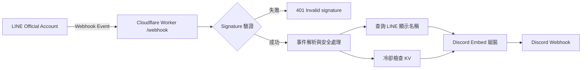

# LINE OA 通知橋接服務（Cloudflare Worker -> Discord）

將 LINE Official Account webhook 事件安全地轉發到 Discord。

此專案會接收 LINE 訊息事件、驗證簽章、防止重放與濫發，最後以易讀的 Discord Embed 格式送到指定頻道，適合用於客服通知、社群監控、營運告警等場景。

## 這個專案在做什麼

資料流如下：

1. LINE OA 呼叫 `POST /webhook`
2. Worker 驗證 `X-Line-Signature`
3. 解析事件並過濾不支援或過期事件
4. （可選）使用 LINE Channel access token 查詢顯示名稱
5. 組裝 Discord Embed 並發送至 Webhook URL

## 系統架構



## 主要功能

- 支援 `POST /webhook` 接收 LINE webhook
- 驗證 LINE 簽章，防止偽造請求
- 目前支援文字訊息轉發
- 事件時效檢查（預設超過 5 分鐘略過）
- 使用者級冷卻抑制（需綁定 KV）
- 自動中和 Discord mention（`@everyone`、`@here`、`<@...>`）
- 訊息長度保護（超過 1000 字自動裁切）
- Discord 429 / 5xx / 網路錯誤自動重試（最多 3 次）
- 健康檢查端點：`GET /health`
- 受保護 debug 端點：
  - `POST /debug/send-test`（直接測 Discord 可用性）
  - `POST /debug/line-simulate`（模擬 LINE 訊息格式）

## 系統需求

- Node.js 20+
- Cloudflare 帳號
- LINE Developers Channel（Messaging API）
- Discord Webhook URL

## 環境變數

| 變數 | 必填 | 用途 | 範例 |
| --- | --- | --- | --- |
| `LINE_CHANNEL_SECRET` | 是 | 驗證 LINE 簽章 | `xxxxxxxx` |
| `LINE_CHANNEL_ACCESS_TOKEN` | 是 | 查詢 LINE 使用者顯示名稱 | `xxxxxxxx` |
| `DISCORD_WEBHOOK_URL` | 是 | Discord 通知目標 | `https://discord.com/api/webhooks/...` |
| `DEBUG_API_KEY` | 是 | 保護 debug 端點 | `strong-random-key` |
| `LOG_LEVEL` | 否 | 日誌等級 | `info` |
| `COOLDOWN_SECONDS` | 否 | 同使用者通知冷卻秒數 | `120` |

建議：

- 本機開發使用 `.dev.vars`
- 正式環境使用 `wrangler secret put` 管理敏感值

## 快速開始

### 1) 安裝與本機設定

```bash
npm install
cp .dev.vars.example .dev.vars
```

編輯 `.dev.vars`：

```env
LINE_CHANNEL_SECRET=your_line_channel_secret
LINE_CHANNEL_ACCESS_TOKEN=your_line_channel_access_token
DISCORD_WEBHOOK_URL=https://discord.com/api/webhooks/xxx/yyy
DEBUG_API_KEY=your_debug_api_key
LOG_LEVEL=info
COOLDOWN_SECONDS=120
```

### 2) 啟動本機開發

```bash
npm run dev
```

可選：執行型別檢查

```bash
npm run typecheck
```

### 3) 設定 `wrangler.toml`（建議）

若你是開源專案維護者，建議使用私有設定檔，避免把 Cloudflare 資源 ID 寫入版本庫：

```bash
cp wrangler.toml.example wrangler.toml
```

再將你的 KV `id` / `preview_id` 填入 `wrangler.toml`。

## 部署到 Cloudflare

先設定 secrets：

```bash
npx wrangler secret put LINE_CHANNEL_SECRET
npx wrangler secret put LINE_CHANNEL_ACCESS_TOKEN
npx wrangler secret put DISCORD_WEBHOOK_URL
npx wrangler secret put DEBUG_API_KEY
```

若要啟用冷卻抑制，建立 KV Namespace：

```bash
npx wrangler kv namespace create NOTIFY_STORAGE
npx wrangler kv namespace create NOTIFY_STORAGE --preview
```

最後部署：

```bash
npm run deploy
```

補充：

- `COOLDOWN_SECONDS` 預設為 `120`
- 若未綁定 `NOTIFY_STORAGE`，服務仍可運作，但不會啟用冷卻抑制
- 私有 repo 或可公開 KV ID 的情境，可直接在 `wrangler.toml` 的 `[[kv_namespaces]]` 設定 ID

## LINE 後台設定

1. 到 LINE Developers Console -> Messaging API
2. Webhook URL 設為 `https://<your-worker-domain>/webhook`
3. 開啟 Use webhook
4. 按 Verify，確認 LINE 可成功呼叫

## API 端點總覽

| Method | Path | 用途 | 保護機制 |
| --- | --- | --- | --- |
| GET | `/health` | 健康檢查 | 無 |
| POST | `/webhook` | 接收 LINE 事件並轉發 Discord | `X-Line-Signature` |
| POST | `/debug/send-test` | 不經 LINE，直接測 Discord 發送 | `X-Debug-Key` |
| POST | `/debug/line-simulate` | 模擬 LINE 格式，測 Embed 組裝流程 | `X-Debug-Key` |

## 專案結構

```text
src/
  index.ts                 # 路由與請求進入點
  types.ts                 # 全域型別
  line/
    verifySignature.ts     # LINE 簽章驗證
    parseEvents.ts         # 事件解析
    fetchDisplayName.ts    # 取得顯示名稱
  discord/
    buildEmbed.ts          # Embed 組裝
    sendWebhook.ts         # Discord 發送與重試
  utils/
    logger.ts              # 結構化日誌
```

## 測試方式

### 1) Health check

```bash
curl http://127.0.0.1:8787/health
```

### 2) 測試 webhook（含簽章）

建立測試 payload：

```bash
cat > /tmp/line-payload.json <<'JSON'
{
  "destination": "Uxxxxxxxx",
  "events": [
    {
      "type": "message",
      "timestamp": 1760000000000,
      "source": {
        "type": "user",
        "userId": "U1234567890"
      },
      "message": {
        "id": "111111111",
        "type": "text",
        "text": "測試訊息 from LINE OA"
      }
    }
  ]
}
JSON
```

產生 LINE 簽章：

```bash
SIGNATURE=$(openssl dgst -sha256 -hmac "$LINE_CHANNEL_SECRET" -binary /tmp/line-payload.json | openssl base64)
```

送到本機 webhook：

```bash
curl -i http://127.0.0.1:8787/webhook \
  -X POST \
  -H "Content-Type: application/json" \
  -H "X-Line-Signature: $SIGNATURE" \
  --data-binary @/tmp/line-payload.json
```

### 3) 直接測 Discord（不經 LINE）

```bash
curl -i http://127.0.0.1:8787/debug/send-test \
  -X POST \
  -H "X-Debug-Key: $DEBUG_API_KEY"
```

成功回應為 `200`，失敗回應為 `502`。

### 4) 模擬 LINE 訊息格式送 Discord

```bash
curl -i http://127.0.0.1:8787/debug/line-simulate \
  -X POST \
  -H "X-Debug-Key: $DEBUG_API_KEY"
```

此端點與 `/webhook` 使用相同的 Embed 組裝邏輯；若此端點成功，通常可排除 Embed 格式問題。

## 常見問題（Troubleshooting）

### 回應 `401 Invalid signature`

- 確認簽章演算法正確（HMAC-SHA256 + base64）
- 確認計算簽章時使用的是「完全相同」的原始 request body

### Discord 沒收到通知

- 檢查 `DISCORD_WEBHOOK_URL` 格式是否正確：
  - `https://discord.com/api/webhooks/<數字ID>/<token>`
- 先呼叫 `POST /debug/send-test`，若同樣失敗，通常是 Discord 設定問題
- 檢查 Worker log 的 `Discord webhook result` 狀態碼
- 若看到 `webhook_id is not snowflake` 或 `DISCORD_WEBHOOK_URL format is invalid`，代表 URL 格式錯誤

### 有 userId、沒有顯示名稱

- 檢查 `LINE_CHANNEL_ACCESS_TOKEN` 是否有效
- 確認 LINE channel 具備讀取 profile 權限

### LINE Verify 失敗

- 確認 URL 為公開 HTTPS
- 確認路徑為 `/webhook`

## 維運建議

- 啟用 Cloudflare Observability 以追蹤錯誤與延遲
- 定期輪替 `DEBUG_API_KEY` 與 LINE / Discord 密鑰
- 在 Discord 端建立專用 webhook 與最小權限頻道
- 監控 `401`、`429`、`5xx` 比例，異常時優先檢查上游平台狀態

## 貢獻流程

1. Fork 或建立 feature branch
2. 完成功能後先執行 `npm run typecheck`
3. 補上必要文件與測試指令
4. 發送 Pull Request，說明變更動機與影響範圍

## Roadmap

- 支援更多 LINE 訊息類型（圖片、貼圖、檔案）
- 增加重放事件去重策略（event id 層級）
- 提供多 Discord channel 路由規則
- 補齊自動化測試（單元測試 / 整合測試）
